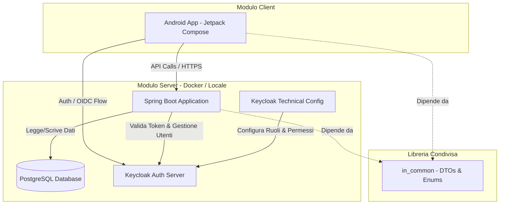

# ✈️ Dèrive (Travel App) - Guida Completa alla Configurazione e Sviluppo

Benvenuto nel repository di **Dèrive**! Questa guida contiene tutte le istruzioni necessarie per comprendere il funzionamento dell'applicazione e configurare l'ambiente di sviluppo locale al primo clone del repository.

---

## 🏛️ Architettura del Progetto

Il progetto è strutturato come un'applicazione client-server distribuita su più moduli, progettata per essere scalabile e sicura:



### Componenti Principali:
1. **Frontend (`frontend`)**: Applicazione nativa Android sviluppata in Kotlin utilizzando **Jetpack Compose** per la UI. Integra Retrofit per le comunicazioni API, OkHttp, Coil per il caricamento delle immagini e il PayPal Checkout Android SDK per le transazioni.
2. **Backend (`backend`)**: Web API basata su **Spring Boot 3.x (Java 21)**. Si occupa della logica di business, della persistenza dei dati, dell'invio delle mail, della gestione dei caricamenti di file e dell'interazione con servizi di terze parti come PayPal e Unsplash.
3. **Libreria Condivisa (`in_common`)**: Modulo Java contenente le definizioni comuni di DTO (Data Transfer Objects) e Enum. Assicura che la struttura dei dati scambiati tra Frontend e Backend sia sempre sincronizzata ed evita la duplicazione del codice.
4. **Identity & Access Management (`keycloak`)**: Gestione di accessi, registrazioni e ruoli utente delegata a **Keycloak (quay.io/keycloak/keycloak:latest)** tramite il protocollo OpenID Connect (OIDC).
5. **Database (`db`)**: Database relazionale **PostgreSQL 15** per la memorizzazione dei dati di dominio dell'applicazione (es. profili utente, esperienze di viaggio, prenotazioni, preferiti).

---

## 🛠️ Prerequisiti

Prima di iniziare, assicurati di aver installato i seguenti strumenti sulla tua macchina di sviluppo:

*   **Docker & Docker Desktop** (Fondamentale per avviare il database, Keycloak e facoltativamente il backend).
*   **Java Development Kit (JDK) 21** (Necessario per compilare la libreria `in_common` e per l'esecuzione del backend al di fuori di Docker).
*   **Android Studio** (Koala o successivo, per importare ed eseguire il frontend).
*   **Apache Maven (facoltativo)** (Per compilare localmente tramite terminale).

---

## 🚀 Configurazione Iniziale (Primo Clone)

Segui rigorosamente questi passaggi per configurare l'ambiente locale al primo clone del repository.

### 1. Configurazione del file `.env` (Root del Progetto)

Crea un file nominato `.env` nella directory principale (**root**) del progetto. Questo file definisce le variabili d'ambiente condivise tra i container Docker.

> [!IMPORTANT]
> È necessario impostare `HOST_IP` con l'indirizzo IP locale del tuo computer all'interno della rete Wi-Fi/LAN (es. `192.168.1.5` o `172.20.10.3`). **Non utilizzare `localhost`** se intendi testare l'app su un dispositivo fisico o sull'emulatore Android, altrimenti il dispositivo mobile non riuscirà a contattare i servizi in esecuzione sul computer.

Usa il seguente template per il file `.env`:

```env
# IP del computer di sviluppo nella rete locale
HOST_IP=192.168.1.X

# Configurazione PayPal Sandbox
PAYMENT_MOCK=false
PAYPAL_CLIENT_ID=INSERISCI_IL_TUO_CLIENT_ID_SANDBOX
PAYPAL_CLIENT_SECRET=INSERISCI_IL_TUO_CLIENT_SECRET_SANDBOX
```

*   `PAYMENT_MOCK`: Impostalo su `true` se vuoi bypassare i controlli reali di PayPal ed effettuare pagamenti di test istantanei simulati dal backend.

---

### 2. Allineamento e Compilazione della Libreria Condivisa (`in_common`)

Poiché il file `.jar` compilato del modulo `in_common` è escluso dal controllo di versione (`.gitignore`), è necessario compilarlo manualmente la prima volta (e ogni volta che apporti modifiche ai DTO in `in_common`) per consentire ad Android Studio di riconoscerlo.

Esegui il comando corrispondente al tuo sistema operativo dalla cartella root del progetto:

#### 💻 Windows (PowerShell):
```powershell
mvn -f in_common/pom.xml clean package ; Copy-Item -Path "in_common\target\common-dtos-1.0.0.jar" -Destination "frontend\app\libs\common-dtos-1.0.0.jar" -Force
```

#### 🍎 macOS / Linux (Bash):
```bash
mvn -f in_common/pom.xml clean package && cp in_common/target/common-dtos-1.0.0.jar frontend/app/libs/
```

> [!NOTE]
> Il frontend Android fa riferimento alla directory `in_common` come modulo Gradle locale tramite `settings.gradle.kts` (`include(":common-dtos")`), ma necessita comunque del jar precompilato all'interno della cartella `libs/` dell'app per risolvere alcune dipendenze a livello di IDE.

---

### 3. Configurazione del file `local.properties` (Frontend)

Apri la cartella `frontend` all'interno di Android Studio. Il file `local.properties` viene generato automaticamente puntando al tuo SDK Android. Apri questo file e aggiungi le configurazioni per indicare all'applicazione Android dove si trovano il backend e Keycloak.

Modifica/Aggiungi le seguenti righe sostituendo `<IP_DEL_PROPRIO_PC>` con lo stesso IP inserito in `.env`:

```properties
# Indirizzo del server backend
backend.url=http://<IP_DEL_PROPRIO_PC>:8080/

# Indirizzo del server Keycloak
keycloak.url=http://<IP_DEL_PROPRIO_PC>:8081/
```

---

## 🐳 Avvio dell'Infrastruttura (Docker Compose)

Il progetto include una configurazione Docker Compose completa che si occupa di istanziare, collegare e configurare tutti i servizi server.

Per avviare l'infrastruttura, apri un terminale nella root del progetto ed esegui:

```bash
docker compose up -d --build
```

Questo comando avvierà i seguenti servizi:

| Servizio | Porta Esterna | Descrizione |
| :--- | :--- | :--- |
| **db** | `5433` (interna `5432`) | Database PostgreSQL per la persistenza locale. |
| **keycloak** | `8081` (interna `8080`) | Server di identità e accessi OIDC. |
| **keycloak-config** | *Temporaneo* | Script automatico che attende l'avvio di Keycloak, verifica l'importazione del realm e configura i permessi di amministrazione per il backend. |
| **backend** | `8080` (interna `8080`) | Applicazione Spring Boot. All'avvio compila internamente il modulo `in_common` ed esegue l'app con profilo di sviluppo `dev`. |

### 🛑 Ripristino dell'ambiente in caso di errori
Se si riscontrano problemi di consistenza dei dati, modifiche al file realm o errori nei ruoli utente su Keycloak, è consigliabile eliminare i volumi Docker e riavviare da zero:

```bash
# Arresta e rimuove tutti i container e i volumi associati (incluso il DB)
docker compose down -v

# Riavvia forzando la compilazione
docker compose up -d --build
```

---

## 🔐 Sicurezza e Accesso Utenti (Keycloak)

Keycloak gestisce in modo centralizzato le identità. Durante l'avvio con Docker Compose, viene importato automaticamente il file di configurazione `keycloak/ae-realm-realm.json`.

### Console di Amministrazione Keycloak:
*   **URL**: `http://localhost:8081` (oppure `http://<IP_DEL_PROPRIO_PC>:8081`)
*   **Username**: `admin`
*   **Password**: `admin`

### Dettagli del Realm Importato (`ae-realm`):
*   **Client App (Frontend)**: `ae-client` (Secret di sviluppo: `travel-dev-secret`)
*   **Client Backend (Service Account)**: `travel-backend-admin` (Secret: `travel-backend-admin-secret`). Questo client tecnico consente al backend Spring Boot di interagire programmaticamente con le API amministrative di Keycloak per creare nuovi utenti in fase di registrazione.

### Utenti di Test Precaricati:
Puoi utilizzare questi utenti predefiniti per testare i flussi autorizzativi nell'applicazione:

1.  **Utente Standard**:
    *   **Username / Email**: `basic-user`
    *   **Password**: `password`
    *   **Ruoli assegnati**: `BASIC`
2.  **Utente Amministratore**:
    *   **Username / Email**: `admin-user`
    *   **Password**: `password`
    *   **Ruoli assegnati**: `BASIC`, `ADMIN`

---

## 🧪 Test e Verifica dell'Ambiente (API Testing)

Dopo avviare Docker Compose, puoi verificare che tutto funzioni correttamente effettuando dei test sulle API del backend tramite **Swagger UI** o client come Postman.

### Documentazione Interattiva (Swagger):
*   **URL**: `http://localhost:8080/swagger-ui/index.html`

### 1. Flusso di Registrazione (`Signup`)
Crea un nuovo utente nel sistema. La chiamata registrerà l'utente contemporaneamente su Keycloak e sul database locale di Dèrive.

*   **Metodo**: `POST`
*   **URL**: `http://localhost:8080/api/auth/signup`
*   **Body (JSON)**:
    ```json
    {
      "email": "test-user@example.com",
      "password": "Password123!",
      "firstName": "Mario",
      "lastName": "Rossi"
    }
    ```
*   **Risultato Atteso**: Status `200 OK` (Registrazione completata).

### 2. Flusso di Login
Verifica le credenziali su Keycloak e ottieni il token di sessione (JWT).

*   **Metodo**: `POST`
*   **URL**: `http://localhost:8080/api/auth/login`
*   **Body (JSON)**:
    ```json
    {
      "email": "test-user@example.com",
      "password": "Password123!"
    }
    ```
*   **Risultato Atteso**: Un JSON contenente l'access token JWT (`eyJ...`).

### 3. Accesso ad Endpoint Protetti
Copia il token ottenuto nella chiamata di login e utilizzalo come intestazione `Authorization: Bearer <TOKEN>` per accedere alle API protette:

*   **Endpoint Utente Registrato**:
    *   `GET http://localhost:8080/api/basic`
    *   *Requisito*: Autenticato con ruolo `BASIC`.
*   **Endpoint Amministratore**:
    *   `GET http://localhost:8080/api/admin`
    *   *Requisito*: Autenticato con ruolo `ADMIN`. Se effettuata con l'utente standard, questa chiamata restituirà `403 Forbidden`.

---

## 🎨 Importazione ed Allineamento Grafico (`theme_import`)

La cartella `theme_import` contiene le definizioni degli stili, dei colori e della tipografia estratti o esportati da strumenti di design (come Figma Material Theme Builder).

Se il team di design modifica la palette di colori o le definizioni dei temi grafici dell'applicazione, puoi allineare il frontend in questo modo:
1.  Sostituisci i file Kotlin `Color.kt`, `Theme.kt`, e `Type.kt` presenti in `theme_import/ui/theme/` all'interno della directory del frontend:
    `frontend/app/src/main/java/com/travel/app/presentation/theme/`
2.  Aggiorna le risorse grafiche in XML (es. drawables o values) presenti in `theme_import/res/` posizionandole sotto `frontend/app/src/main/res/`.

---

## 📧 Notifiche e Servizio Mail (SMTP)

Il backend integra l'invio automatico di email transazionali (es. registrazioni, notifiche di acquisto, ripristino password). Nel file `docker-compose.yml` è configurato per impostazione predefinita il servizio email tramite un server Gmail (`smtp.gmail.com` sulla porta `587`).

Se riscontri problemi nell'invio delle email o desideri configurare un server di test locale (come Mailpit o Mailhog):
1.  Modifica i parametri `SPRING_MAIL_*` all'interno del file `docker-compose.yml` sotto la voce `backend`.
2.  Assicurati di impostare credenziali corrette se usi un server reale, oppure configura un server SMTP di sviluppo locale integrato nel Docker Compose.

---

Buon lavoro e buon viaggio con il team di sviluppo di **Dèrive**! ✈️
